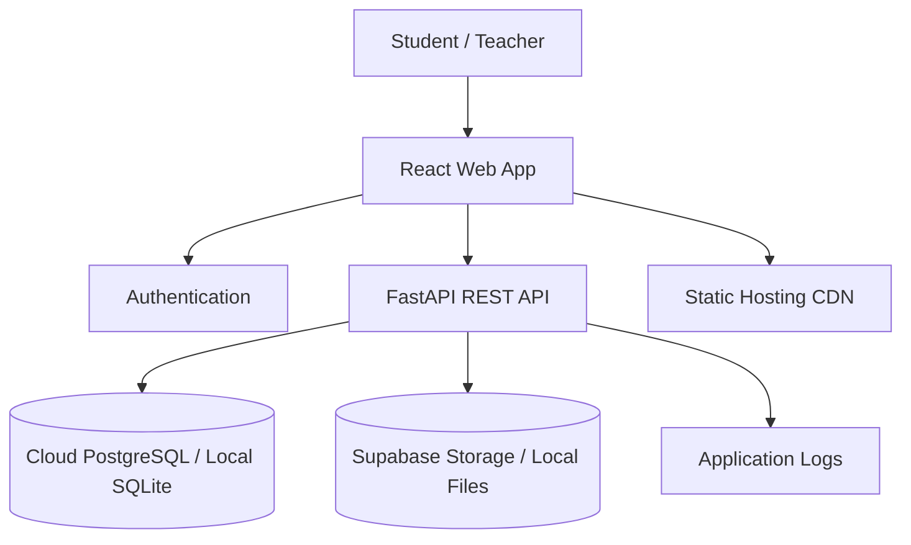

# Architecture

```mermaid
flowchart TD
    U[Student / Teacher] --> FE[React Web App]
    FE --> AUTH[Authentication]
    FE --> API[FastAPI REST API]
    API --> DB[(Cloud PostgreSQL / Local SQLite)]
    API --> OBJ[(Supabase Storage / Local Files)]
    API --> LOG[Application Logs]
    FE --> CDN[Static Hosting CDN]
```

Cloud mode:
React static site -> CDN/static hosting -> FastAPI -> Supabase Auth + PostgreSQL + Storage.

Local mode:
React -> FastAPI -> SQLite + local uploads.
